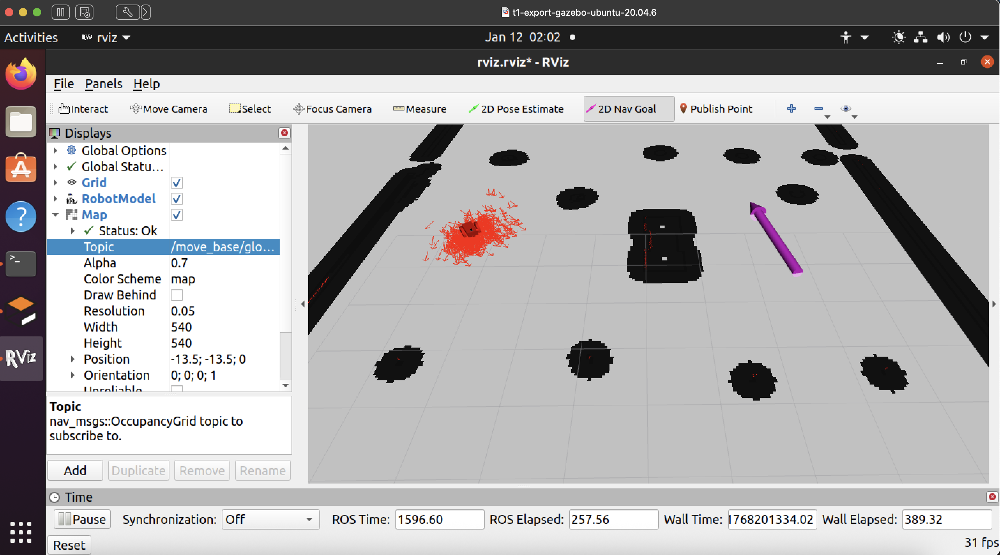
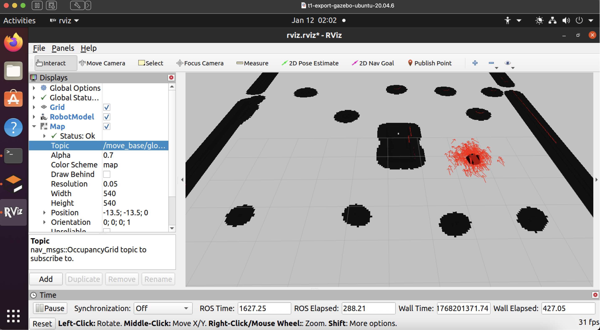
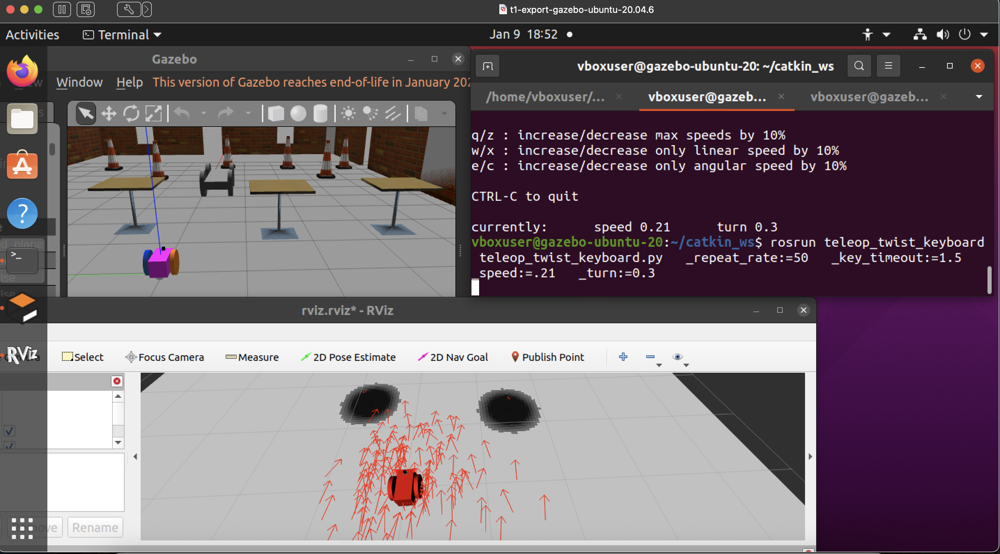
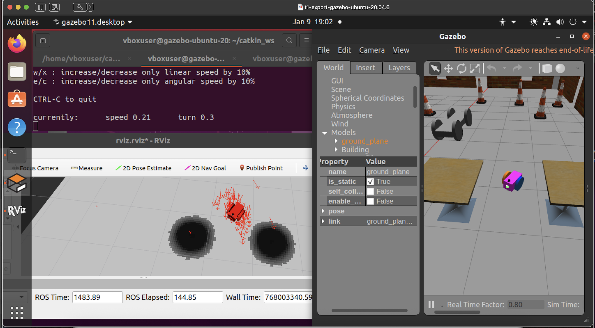
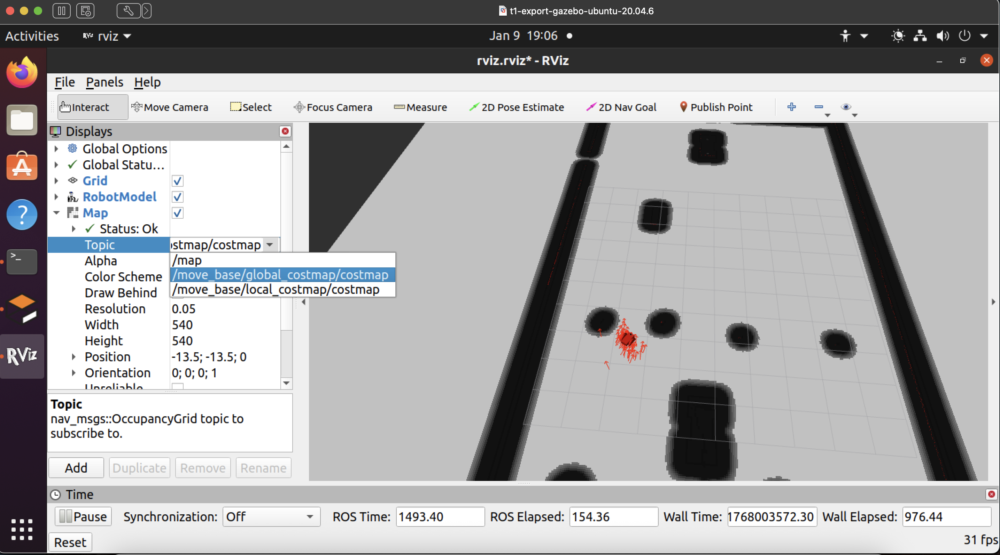
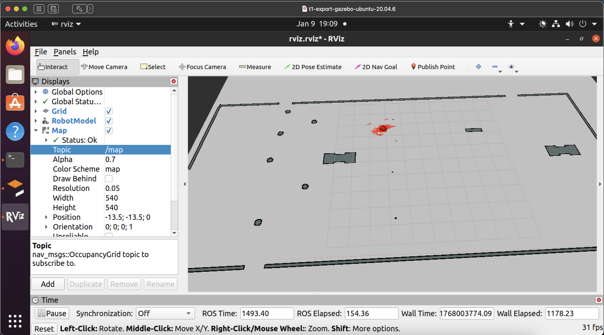
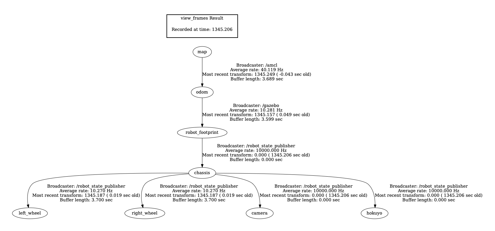

# Project 3 AMCL
This is the 3rd project in the course, adaptive monte carlo localization. This localizes a wheeled robot in a 3d environment using particles, visualizing them in rviz, and provides a demonstration of navigation to 2d points. 

This repos uses all the old code from the prior 2 projects (existing gazebo world and robot).
You can ignore the `ball_chaser` and `my_robot` (from the old projects); these are needed to reference the old gazebo world and old robot and reuse their code, since it appears each project in the udacity class builds on assets from the previous project. 

The [`gazebo_ros_2Dmap_plugin`](https://github.com/marinaKollmitz/gazebo_ros_2Dmap_plugin/tree/master) was used to generate the map, as suggested by a mentor (link below). The `teleop_twist_keyboard` is for manual control of the robot

## Running
1. The repo should be in the ~/catkin_ws directory
2. Build with `catkin_make`
3. `source develop/setup.bash`
4. Run with `roslaunch amcl_robot amcl_robot.launch` starts the system, launches gazebo, and launches rviz
5. See autonomous navigation below

Note: If the shadows still look weird in gazebo, make sure they are turned off. I fixed this in the gazebo settings, but sometimes it switches back. It seems to be a known issue on non Nvidea systems. I developed this on an Ubuntu 20.04 VM in ROS Noetic on an Intel Mac (AMD GPU).

### autonomous navigation to fixed 2d point
In Rviz, click the 2D navigation button, click on the map, and drag the arrow in the direction of the perferred orientation/yaw of the robot:

Then, the robot will start moving autonomously to that goal, and the particles will continue to localize around the robot. The robot (hopefully) reaches its goal and stops:

Notes: I tried many combinations of different parameters in the config/yaml files. Though the mentors said this lesson is focused on localization and not path planning, I was able to make improvements to fix some issues, because the robot navigation was mostly broken. These include:
- robot stopping abruptly and then starting again (by reducing acceleration)
- robot spinning in circles near the destination goal (added yaw tolerance)
- Robot taking long meandering paths, and not heavily favoring a straight path

Parameters found here https://wiki.ros.org/base_local_planner#Parameters

### Teleop debugging
 Based on the Udacity instructions, do the following: 
 1. git clone https://github.com/ros-teleop/teleop_twist_keyboard in this project root
 2. `catkin_make`
 3. `source devel/setup.bash`
Now, 
run `rosrun teleop_twist_keyboard teleop_twist_keyboard.py _repeat_rate:=<>> _key_timeout:=<> _speed:=0.5 _turn:=1.0`. Then follow the instructions using the keys listed to move the robot accordingly.

Note: teleop is much less smooth and stops motion abruptly, because it doesn't seem to expose parameters (like acceleration) to smooth out the motion, as opposed to the base_local_planner used in the autonomous navigation above. I tried to tune this awhile but after realizing the limitations of teleop I gave up on it. Repeat rate may be something like 20-40 and the timeout something like 0.3

### additional helpful images
1. This first image below is when running the system in 1 terminal; teleop in another terminal; and gazebo and rviz both open (the space is a bit cramped on a small screen). The red arrows show particles. Red lines/dots in the environment represent areas the Lidar has scanned. The map currently shown is the local costmap. Notice the particles at the start are fairly spread out:

2. Notice after driving the robot around, localization improves, and the particles converge toward the robot's real location:

3. In rviz you can toggle between the local cost map to the global cost map:

4. or the static 2d map generated from the .pgm file:

### frame
Learned a little about coordinate frames in Gazebo. Used `rosrun tf tf_echo map base_link
` then `dot -Tpdf ~/catkin_ws/src/frames.gv -o frames.pdf` to generate the PDF to show the tree of frames. The TF tree shows the relationship between the map and base_link frames, where map is the root frame and base_link is a descendent child frame.

### map
Lesson uses a 2D map of the existing gazebo world from past projects. Instructed to use this [repo](https://github.com/marinaKollmitz/gazebo_ros_2Dmap_plugin/tree/master) by the [mentor](https://knowledge.udacity.com/questions/1072496), since the one in the lesson is broken/out of date. 

