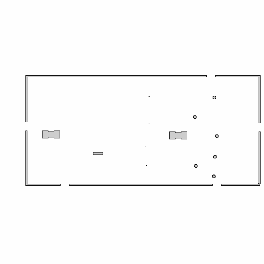

# Project 3 AMCL
This uses all the old code from the prior 2 projects (existing gazebo world and robot).
You can ignore the `ball_chaser` and `my_robot` (from the old projects); these are needed to reference the old gazebo world and old robot and reuse their code. The `gazebo_ros_2Dmap_plugin` was used to generate the map, as suggested by a mentor (link below). The `teleop_twist_keyboard` is for manual control of the robot

## Running
1. The repo should be in the ~/catkin_ws directory
2. Build with `catkin_make`
3. `source develop/setup.bash`
4. Run with `roslaunch amcl_robot amcl_robot.launch` starts the system, launches gazebo, and launches rviz
5. In Gazebo, turn off 'shadows' in `Scene` to remove the dark shading/reduce GPU usage 

### Teleop
In another terminal, run `rosrun teleop_twist_keyboard teleop_twist_keyboard.py   _repeat_rate:=50   _key_timeout:=1.0   _speed:=0.22   _turn:=0.3`

## Misc

### frame
Learned a little about coordinate frames in Gazebo. Used `rosrun tf tf_echo map base_link
` then `dot -Tpdf ~/catkin_ws/src/frames.gv -o frames.pdf` to generate the PDF to show the tree of frames. The TF tree shows the relationship between the map and base_link frames, where map is the root frame and base_link is a descendent child frame.

### map
Lesson uses a 2D map of the existing gazebo world from past projects. Instructed to use this [repo](https://github.com/marinaKollmitz/gazebo_ros_2Dmap_plugin/tree/master) by the [mentor](https://knowledge.udacity.com/questions/1072496), since the one in the lesson is broken/out of date. 

